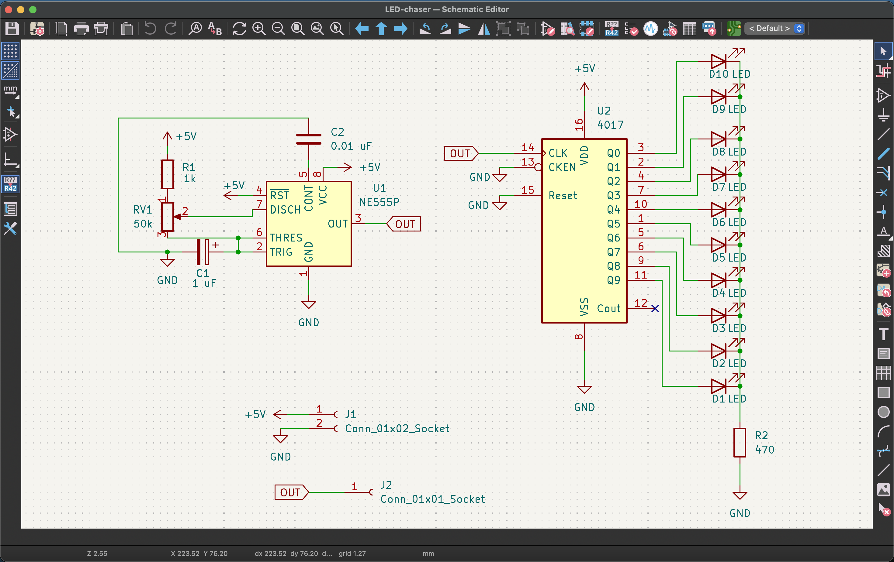

# Blinky Board (555 LED Chaser) Journal
 
---
 
## Entry 1 — Finally started, schematic done!!
 
ok so i finally opened KiCad after putting it off for like 3 days. ngl i was kinda intimidated but the guide made it pretty straightforward.
 
the plan is simple: 555 timer in astable mode = it just keeps oscillating forever, clocking the CD4017 counter. the 4017 then lights up 10 LEDs one at a time in sequence. pretty sick concept honestly.
 
### Stuff i placed
 
- **NE555P** — the timer
- **CD4017** — decade counter
- **1k resistor** — for the 555 timing
- **Potentiometer (RV)** — to control speed (this is the fun part, you can make it go zoom or snail pace)
- **100nF cap** — normal ceramic one
- **10uF electrolytic cap** — POLARIZED so direction matters!! almost messed this up
- **470Ω resistor** — shared by all LEDs
- **10 LEDs**

### Problems i hit
 
- pin names were confusing af at first. like why is it `CLKEN` and not just `CLK_EN`? took me a sec to figure out clock inhibit means "stop the clock" so we ground it
- wires were EVERYWHERE and it looked like spaghetti. switched to using labels instead and it looks way cleaner now
- the 555 astable config had me googling for like 20 mins. the capacitor goes between pin 2 and 6?? and then to ground?? eventually got it tho
### Screenshots

---

---

---
 

---
 
 
**Time spent:** 3 hours (mostly googling tbh)
 
---

## Entry 2 — Footprints (this was kinda annoying)
 
assigned footprints to everything today. honestly this part was lowkey tedious but whatever.
 
### CD4017 footprint situation
 
so the guide said the CD4017 footprint isn't in KiCad by default which is actually so annoying?? like why wouldn't they include it. had to download from Ultra Librarian and import it. the import process was kinda confusing but i followed the guide step by step.  
 

checked pin spacing against the datasheet and everything seemed to line up. the 4017 is 2.54mm pitch which is standard for DIP so we good.
 
ran **Update PCB from Schematic** and everything showed up in the PCB editor in a big pile in the corner lol. 
 
### What went wrong
 
- spent like 30 mins confused about why my CD4017 symbol didn't have a footprint assigned. turns out i had to manually add it because it's not in the default library. dumb.

### Screenshots
 

 
**Time spent:** 1.5 hours
 
---

## Entry 3 — Board Outline, Routing + DRC (the struggle was real)
 
The guide is strict that the board needs a custom outline and custom art, so I spent a good chunk of this session on the shape. I used canva to make a cat head shaped designed and then I converted it to dxf using image to dxf converter. 

Then I placed the components inside the outline. What I learned:
- The thin blue lines are **ratlines**. They show which pads still need to connect.
- The goal is to move parts around so the ratlines are short and don't cross each other. This makes the routing later way easier.
- "r" rotates a part, and Ctrl+S is your friend. I saved every few minutes so I wouldn't lose progress.
ngl this part felt kinda like a puzzle. trying to fit everything without crossing lines too much. not perfect but it works.

ok so routing. this is where things got spicy.
 
routed the two-layer board with the "X" shortcut. used vias (V) when i had to switch to the back copper layer. honestly routing is kinda satisfying when it works but also infuriating when you get stuck.
 
### Ground plane situation
 
yes i added a ground plane on the bottom layer. the guide said it helps with noise and honestly it just looks professional. pressed "B" to fill it and everything.
 
### DRC errors
 
ran DRC and got like 15 errors initially  
 
- mostly clearance violations (traces too close to each other)
- a couple of unconnected items
- one via that was too close to a pad
fixed them by:
 
1. rerouting some traces with more spacing
2. moving that one via
3. re-running DRC like 5 times until it was clean
### Screenshots
 

 
**Time spent:** 4 hours (routing is pain)
 
---

## Entry 4 - Adding art in my pcb

I had sent the PCB image in the half-life channel and shadow gave suggestions to add arts in the pcb so I added some cute cat images.

**Time spent:** 1 hours (routing is pain)
