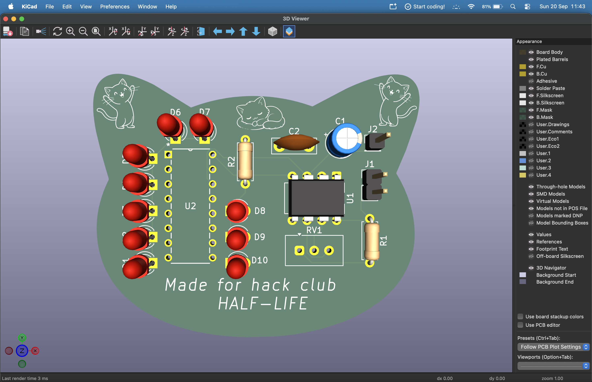
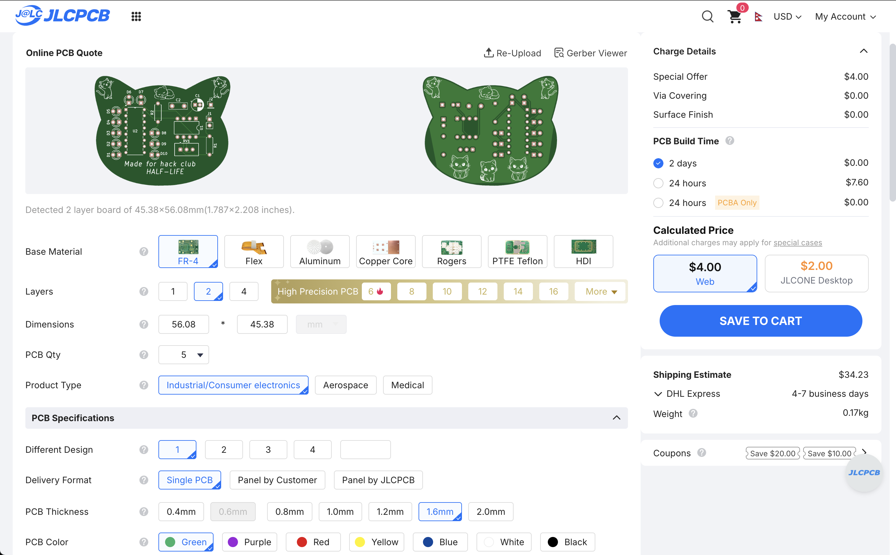
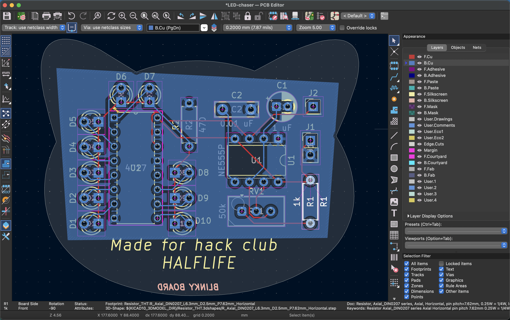
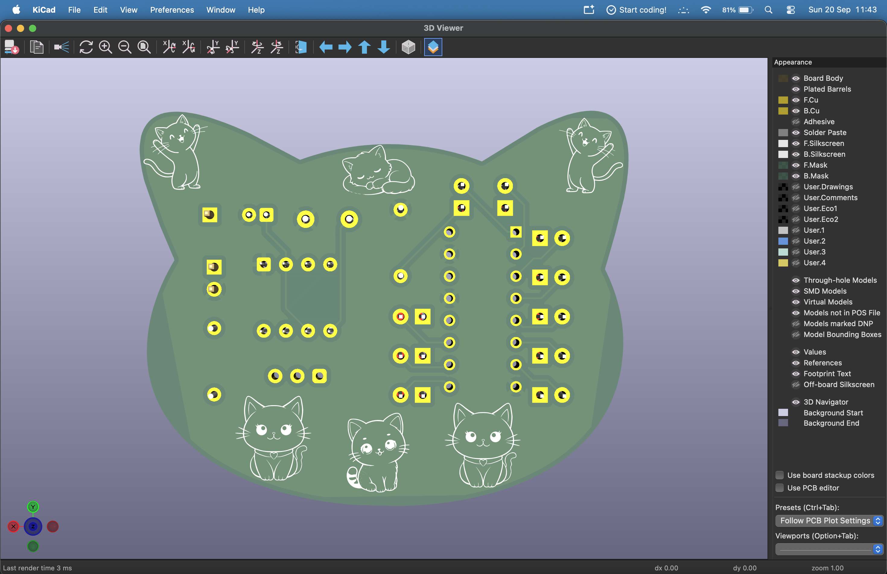

# Blinky Board (555 LED Chaser)

my first ever PCB!! its a little board with 10 LEDs that chase each other in a loop, and theres a knob on it so you can change how fast they go. thats it. thats the whole thing. but it works and honestly im so proud of it.

built this for Hack Club Halflife and i went in knowing basically nothing about PCB design so if i can do it you definately can.

---

## how it works
 
NE555 runs in astable mode and just oscillates forever, the speed depends on R1, C1 and the pot. that clock feeds the CD4017 (a decade counter) which moves its output over by one every pulse, 0 through 9 then loops back. put an LED on each output and you get the chase effect.
 
all 10 LED cathodes share ONE 470Ω resistor to ground since only one LED is ever on at a time, so you dont need 10 separate ones. blue LEDs come out a bit dimmer tho cause of higher forward voltage.
 
4017 wiring: VDD to +5V, VSS/CLKEN/RESET to GND, CLK to the 555 output pin 3, Cout unused.

---

## Bill of Materials

19 components total, comes out to about **$5.09** in parts.

| Ref | Qty | Value | Footprint | Link | Unit | Total |
|-----|-----|-------|-----------|------|------|-------|
| C1 | 1 | 1 µF | Capacitor_THT:CP_Radial_D5.0mm_P2.00mm | [LCSC C43342](https://www.lcsc.com/product-detail/C43342.html) | $0.14 | $0.14 |
| C2 | 1 | 0.01 µF | Capacitor_THT:C_Disc_D7.5mm_W2.5mm_P5.00mm | [LCSC C454399](https://www.lcsc.com/product-detail/C454399.html) | $0.17 | $0.17 |
| D1-D10 | 10 | LED | LED_THT:LED_D3.0mm | [LCSC C264302](https://www.lcsc.com/product-detail/C264302.html) | $0.10 | $1.00 |
| J1 | 1 | Conn_01x02_Socket | PinHeader_1x02_P2.54mm_Vertical | [DigiKey 929500-01-02-RK](https://www.digikey.com/en/products/result?keywords=929500-01-02-RK) | $0.10 | $0.10 |
| J2 | 1 | Conn_01x01_Socket | PinHeader_1x01_P2.54mm_Vertical | [DigiKey PRPC001DAAN-RC](https://www.digikey.com/en/products/result?keywords=PRPC001DAAN-RC) | $0.05 | $0.05 |
| R1 | 1 | 1kΩ | R_Axial_DIN0207_L6.3mm_D2.5mm_P7.62mm_Horizontal | [DigiKey CFR-25JR-52-1K](https://www.digikey.com/en/products/detail/yageo/CFR-25JR-52-1K/11974) | $0.05 | $0.05 |
| R2 | 1 | 470Ω | R_Axial_DIN0207_L6.3mm_D2.5mm_P7.62mm_Horizontal | [DigiKey CFR-25JR-52-470R](https://www.digikey.com/en/products/detail/yageo/CFR-25JR-52-470R/11966) | $0.05 | $0.05 |
| RV1 | 1 | 50kΩ | Potentiometer_Vishay_T93YA_Vertical | [LCSC C7061697](https://www.lcsc.com/product-detail/Trimmer-Potentiometers_VISHAY-T93YA503KT20_C7061697.html) | $1.58 | $1.58 |
| U1 | 1 | NE555P | DIP-8_W7.62mm | [LCSC C46749](https://www.lcsc.com/product-detail/Timers-Clocks_NE555P_C46749.html) | $0.56 | $0.56 |
| U2 | 1 | CD4017BE | N16 (DIP-16) | [LCSC C34519](https://www.lcsc.com/product-detail/Counters-Dividers_TI-CD4017BE_C34519.html) | $1.39 | $1.39 |

### cost breakdown

| Part | Cost |
|------|------|
| Capacitors (C1, C2) | $0.31 |
| LEDs (x10) | ~$1.00 |
| Resistors (R1, R2) | $0.10 |
| Potentiometer (RV1) | $1.58 |
| NE555P (U1) | $0.56 |
| CD4017BE (U2) | $1.39 |
| Pin Headers (J1, J2) | $0.15 |
| PCB from JLCPCB (5 boards) | ~$2.00 |
| **parts + PCB** | **~$7.34** |

---

## how to build it

1. order the PCB from JLCPCB using the gerbers in this repo. standard green, 1.6mm, default everything. 5 boards is the minimum
2. order the parts from the links above
3. solder the low stuff first (resistors, then the IC sockets or ICs, then caps, then LEDs, pot last)
4. **WATCH YOUR POLARITY.** C1 is electrolytic so it has a + and a -, and all 10 LEDs have a direction too. the short leg is the cathode. i put one LED in backwards and desoldering it was genuinely worse then all the soldering combined
5. power it with 5V through J1
6. turn the pot and watch it go

if nothing lights up, check RESET and CLKEN are actually grounded, thats usually the problem.

---

## whats in this repo

- the KiCad project files (schematic + PCB)
- gerbers + drill files, ready to send to JLCPCB
- the BOM
- my build journal with all the screenshots and every mistake i made along the way
- images folder

---

## stuff i learned / things that went wrong

- the CD4017 footprint isnt in KiCad by default which is so annoying, had to grab it off Ultra Librarian and import it manually
- using labels instead of drawing wires everywhere made my schematic go from spaghetti to actually readable
- DRC hit me with like 15 errors the first time, mostly clearance stuff where traces were to close together. rerouted with more spacing and it cleaned up
- added a ground plane on the bottom layer, helps with noise and also just looks professional

## Made by
Archana Kunwar 
For hackclub

---
